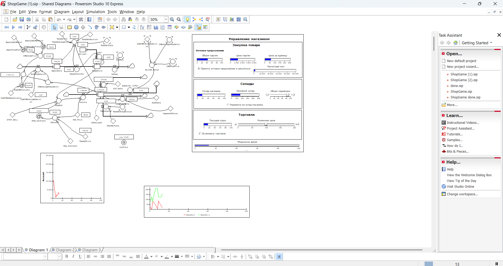
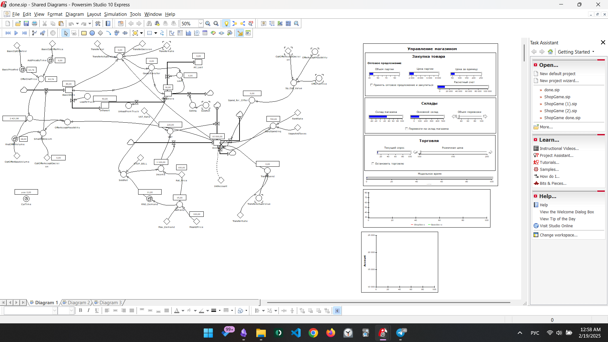
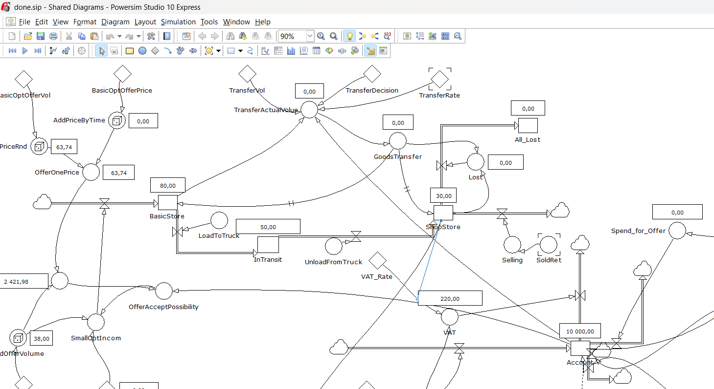

# Задание №3. Разработка динамической потоковой модели с помощью системной динамики

Системная динамика — это метод моделирования и анализа сложных систем, основанный на понимании их структуры, взаимосвязей и процессов обратной связи. Она помогает исследовать, как изменения в одной части системы могут повлиять на её поведение во времени. Основные элементы системной динамики — это переменные состояния (накопления), потоки (изменения накоплений), петли обратной связи и задержки во времени. Этот подход широко применяется для прогнозирования последствий управленческих решений.

Иными словами, системная динамика — это способ понять, как разные части чего-то большого работают вместе и влияют друг на друга.

Пример:
Рассмотрим модель экономического роста компании:
- Переменные состояния (количество клиентов, уровень дохода).
- Потоки (привлечение новых клиентов, потеря старых).
- Обратная связь (увеличение доходов позволяет вкладывать больше средств в рекламу, что привлекает новых клиентов).
- Задержка (между запуском рекламы и ростом числа клиентов проходит некоторое время).

Powersim Studio — это программа для моделирования системной динамики. Она позволяет создавать модели сложных систем, визуализировать причинно-следственные связи и анализировать поведение системы во времени.

## Постановка задачи
Необходимо доработать модель торговой точки, созданную в Powersim Studio, добавив новый уровень и переработав модель в алгоритмическую программу. Выбран вариант учета перевозки товара через промежуточный склад.

## Ход работы
Новый уровень: Промежуточный уровень между складом и магазином (InTransit)
Новые потоки: Погрузка (LoadToTruck) и Выгрузка (UnloadFromTruck)

**Обобщенный алгоритм программы**
У нас есть оптовый склад (Basic Store) и магазин (ShopStore). Из оптового склада в магазин через заданный промежуточный уровень (InTransit) загружают (LoadToTruck) и выгружают (UnloadFromTruck) определенное количество товаров (TransferActualVol), что могут потеряться (Lost), если привезти слишком много. Товары так же продаются bз магазина со временем.

Исходная модель:

Обновленная диаграмма:

## Итоги и выводы

Добавление промежуточного склада позволило детальнее смоделировать процесс логистики. Программа построена по предложенному алгоритму, поддерживает пошаговый ввод и вывод данных. Итоговый код приведен в отдельном файле.