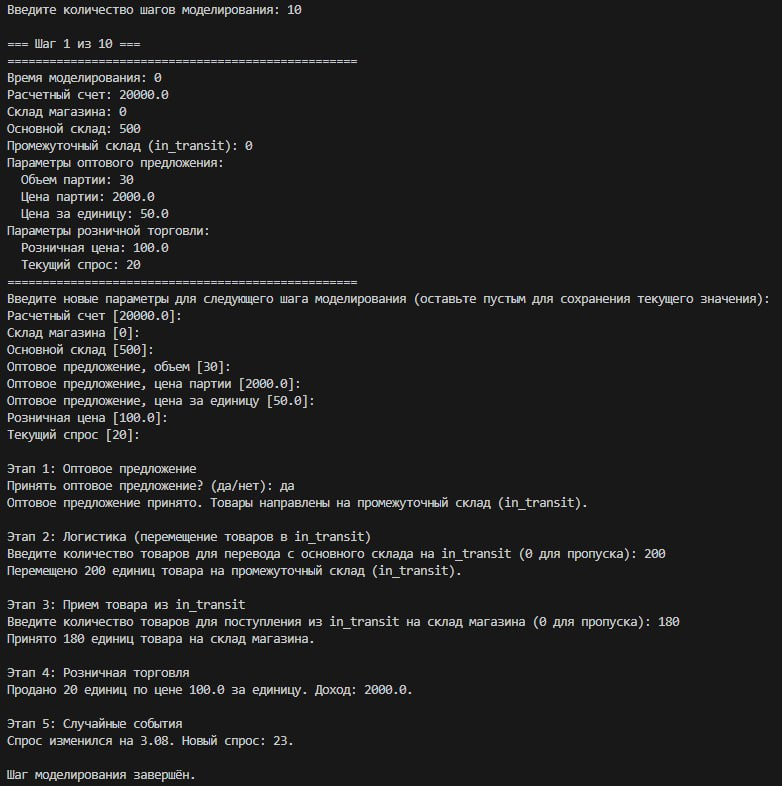

# Задание №3. Разработка динамической потоковой модели с помощью системной динамики

Системная динамика — это метод моделирования и анализа сложных систем, основанный на понимании их структуры, взаимосвязей и процессов обратной связи. Она помогает исследовать, как изменения в одной части системы могут повлиять на её поведение во времени. Основные элементы системной динамики — это переменные состояния (накопления), потоки (изменения накоплений), петли обратной связи и задержки во времени. Этот подход широко применяется для прогнозирования последствий управленческих решений.

Иными словами, системная динамика — это способ понять, как разные части чего-то большого работают вместе и влияют друг на друга.

Powersim Studio — это программа для моделирования системной динамики. Она позволяет создавать модели сложных систем, визуализировать причинно-следственные связи и анализировать поведение системы во времени.

## Постановка задачи
Необходимо доработать модель торговой точки, созданную в Powersim Studio, добавив новый уровень и переработав модель в алгоритмическую программу. Выбран вариант учета перевозки товара через промежуточный уровень.

## Ход работы
Новый уровень: Промежуточный уровень между складом и магазином (InTransit)
Новые потоки: Погрузка (LoadToTruck) и Выгрузка (UnloadFromTruck)

### Исходная модель
Исходная модель имитировала работу торговой точки с основными блоками:
- **Финансовая часть:** расчетный счет, доходы и расходы.
- **Закупки:** оптовое предложение, характеризующееся объемом партии, ценой партии и ценой за единицу товара.
- **Склады:** базовый склад (хранение товара до его поступления в магазин) и склад магазина (товар для продажи).
- **Розничная торговля:** продажи, формирование дохода, изменение спроса.
- **Случайные колебания:** моделирование динамики спроса с элементами случайности.

### Модификация модели
В обновленную модель был добавлен новый уровень **InTransit**, представляющий этап перевозки товара между базовым складом и магазином. Теперь процесс перемещения товара разделен на два этапа:
1. **Перемещение с базового склада на промежуточный уровень (InTransit):** после принятия оптового предложения товар направляется на промежуточное хранение.
2. **Прием товара из промежуточного склада в магазин:** на данном этапе пользователь управляет поступлением товара в магазин.

Кроме того, модель сохраняет возможность пошагового ввода данных. Перед каждым шагом моделирования программа выводит текущие основные параметры объекта (состояние расчетного счета, запасы на базовом складе, промежуточном складе и в магазине, параметры оптового предложения и розничной торговли) и запрашивает у пользователя изменения входных данных для корректировки дальнейшей симуляции.

## 3. Алгоритм программы
Программа реализована на Python и состоит из следующих основных блоков:

1. **Получение инициализационных данных:**
   - Инициализация базовых параметров модели, таких как расчетный счет, запасы на складах, параметры оптового предложения и розничной торговли.
   - Возможность загрузки базовых параметров из внешнего файла (при необходимости).

2. **Инициализация модели:**
   - Создание объекта модели с заданными начальными значениями.
   - Инициализация дополнительных уровней, таких как промежуточный уровень (`in_transit`).

3. **Расчет уровней и темпов:**
   - Моделирование изменения запасов, расчет доходов от продаж, учет перемещений товара между уровнями (базовый склад → in_transit → магазин).
   - Расчет изменений спроса с элементами случайности.

4. **Вывод пошаговых данных:**
   - Перед каждым шагом моделирования выводятся текущие значения основных показателей модели.

5. **Ввод пошаговых данных:**
   - Пользователь имеет возможность изменять параметры модели (например, расчетный счет, объем перевозки, решение о закупке, розничная цена) перед выполнением каждого шага.

6. **Общий вывод после завершения моделирования:**
   - По завершении моделирования выводится итоговое состояние системы, позволяющее оценить динамику работы торговой точки.

### Powersim Studio
Исходная модель:

Обновленная диаграмма:

### Запуск Python-программы
Работа кода:

## Итоги и выводы
Добавление промежуточного уровня между складом и магазином позволило детальнее смоделировать процесс логистики. Программа построена по предложенному алгоритму, поддерживает пошаговый ввод и вывод данных. Итоговый код приведен в отдельном файле.